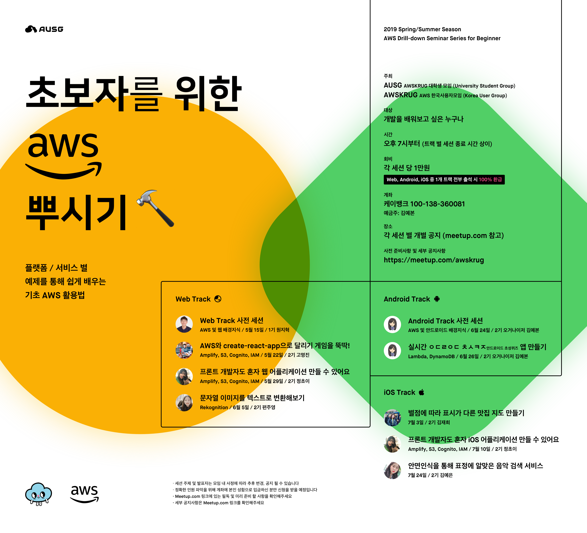

# AUSG Seminar 2019

#### 2019년 상반기 AUSG 세미나 목록입니다. 🤗

#### 2019년 상반기 AUSG 세미나는 WEB🖥, Android📱, iOS🍎 총 3가지 프론트엔드 Track에 맞춰 진행됩니다.

##### 모든 세미나 자료는 현재 깃헙레포를 통해 공개되며 핸즈온 신청은 각 세션이 진행되는 날의 일주일 전부터 meetUp 페이지를 통해 신청할 수 있습니다

#### WEB Track🖥

##### 1회차 : 5월 15일(수) - [Web Track 사전 세션 with AWS IAM](<https://github.com/AUSG/ausg-seminar-2019/tree/master/WebTrack/Preparation>) ([슬라이드](https://github.com/AUSG/ausg-seminar-2019/blob/master/decks/%5BWeb_Track%5D%20Pre_Session.pdf)) by [tonyfromundefined](<https://github.com/tonyfromundefined>)

##### 2회차 : 5월 22일(수) - [AWS와 create-react-app으로 달리기 게임을 뚝딱! with AWS Amplify, AWS Cognito, AWS S3](<https://github.com/AUSG/ausg-seminar-2019/tree/master/WebTrack/WebTrack2>) by [rayleighko](<https://github.com/rayleighko>)

##### 3회차 : 5월 29일(수) - [프론트 개발자도 혼자 웹 어플리케이션 만들 수 있어요 with AWS Amplify, AWS IAM, AWS Cognito, AWS S3, AWS Dynamo DB](<https://github.com/AUSG/ausg-seminar-2019/tree/master/WebTrack/WebTrack3>) by [iamcho2](<https://github.com/iamcho2>)

##### 4회차 : 6월 5일(수) - [문자열 이미지를 텍스트로 변환해보기 with AWS Rekognition](<https://github.com/AUSG/ausg-seminar-2019/tree/master/WebTrack/WebTrack4>) ([슬라이드](https://github.com/AUSG/ausg-seminar-2019/blob/master/decks/%5BWeb_Track%5D%20Image_To_Text.pdf)) by [ravieeeee](https://github.com/ravieeeee)

---

#### Android Track📱

##### 5회차 : 6월 24일(월) - [Android 사전세션 with AWS IAM](<https://github.com/AUSG/ausg-seminar-2019/tree/master/AndroidTrack/preparation>) ([슬라이드](https://github.com/AUSG/ausg-seminar-2019/blob/master/decks/%5BAndroid_Track%5D%20Pre_Session.pdf)) by [yebonkim](https://github.com/yebonkim)

##### 6회차 : 6월 26일(수) - [실시간 ㅇㄷㄹㅇㄷ ㅊㅅㅋㅈ(안드로이드 초성퀴즈) 앱 만들기](https://github.com/yebonkim/android-realtime-quiz) ([슬라이드](https://github.com/AUSG/ausg-seminar-2019/blob/master/decks/%5BAndroid_Track%5D%20Realtime_%20Consonant_Game.pdf)) by [yebonkim](https://github.com/yebonkim)

------

#### iOS Track🍎

##### 7회차 : 7월 3일 - 별점에 따라 표시가 다른 맛집 지도 만들기 by [jaehui327](<https://github.com/jaehui327>)

##### 8회차 : 7월 10일 - 프론트 개발자도 혼자 iOS 어플리케이션 만들 수 있어요 with AWS Amplify, AWS IAM, AWS Cognito, AWS S3 by [iamcho2](<https://github.com/iamcho2>)

##### 9회차 : 7월 24일 - 안면인식을 통해 표정에 알맞은 음악 검색 서비스 만들기 by [kyeahen](<https://github.com/kyeahen>)

