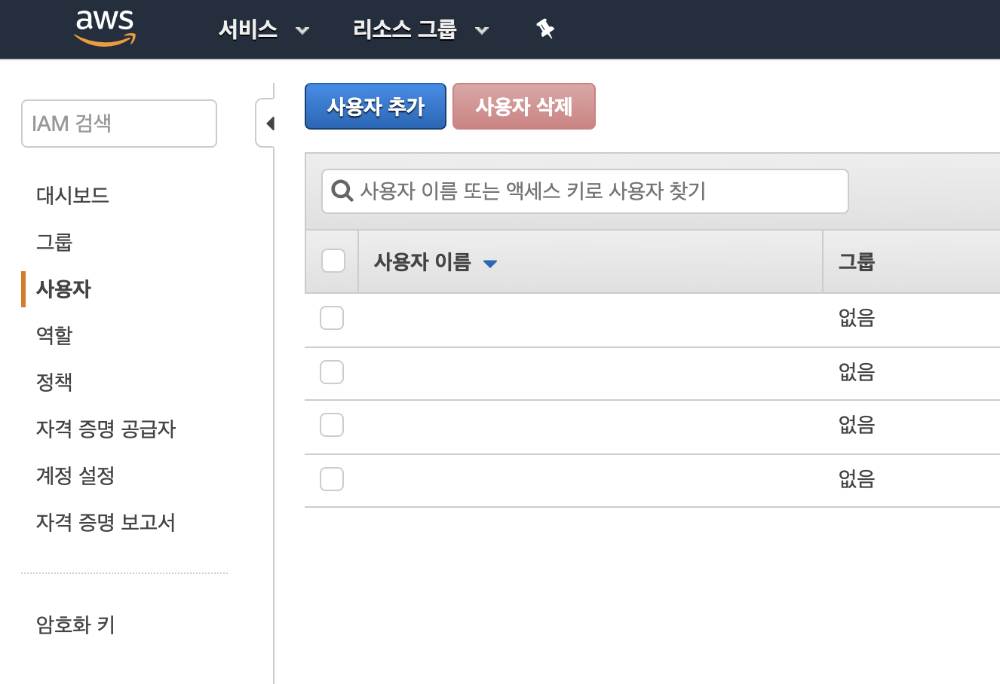
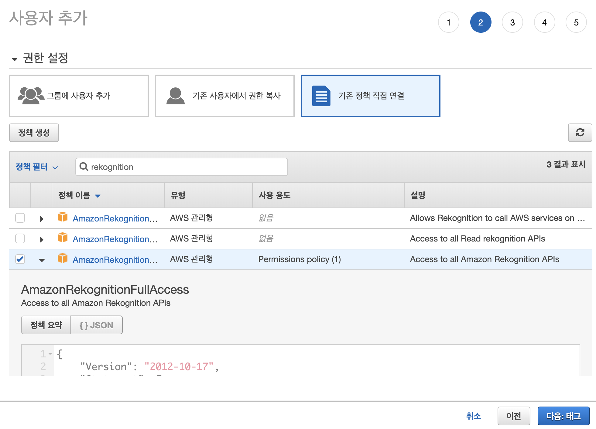
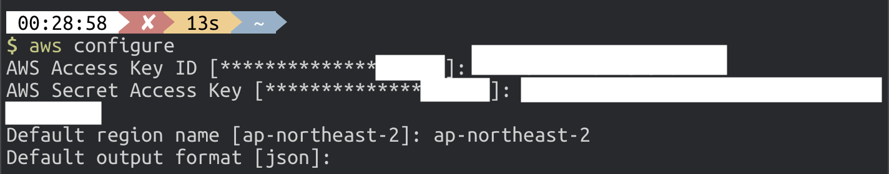

# AWS IAM 사용자 만들기

[aws console](https://ap-northeast-2.console.aws.amazon.com/console/home?region=ap-northeast-2#)에 접속하여 `IAM` 서비스를 찾습니다.


`IAM 대시보드`에 접속했다면, 다음과 같은 화면을 보게됩니다.


왼편의 `사용자` 메뉴로 접속 후, `사용자 추가` 버튼을 클릭합니다.



`사용자 이름`을 작성한 후, `액세스 유형` 중 `프로그래밍 방식 액세스`에 체크합니다. 추후 aws cli에서 이용하기 위해 필요한 설정입니다.  
체크했다면, `다음: 권한` 버튼을 누릅니다.


`기존 정책과 직접 연결`을 클릭한 후, `정책 필터`에 `rekognition`이라고 검색하여 `AmazonRekognitionFullAccess`에 체크합니다.  
이로써 현재 만드는 사용자는 AWS Rekognition 서비스를 모두 이용할 수 있는 권한을 가지게 됩니다.  
체크했다면, `다음: 태그` 버튼을 누릅니다.



`다음: 검토` 버튼을 누릅니다.


설정한 권한을 검토한 후, `사용자 만들기` 버튼을 누릅니다.


다음과 같은 화면이 보이신다면 성공적으로 사용자를 추가한 것입니다! 짝짝짝   
`액세스 키 ID`와 `비밀 액세스 키`가 외부에 노출되지 않도록 보안에 주의하세요.


이제, 만들어진 `액세스 키 ID`와 `비밀 액세스 키`를 이용해서 현재 본인의 local 환경에 aws cli를 이용하여 해당 사용자를 등록하도록 하겠습니다.  
그러기 전에 일단 `aws-cli`를 설치해야 합니다.

- [aws cli](https://aws.amazon.com/ko/cli/)에 접속하여 설치하시면 됩니다.

설치가 완료되었다면, 터미널을 열어 아래 명령어를 입력하시면 `액세스 키 ID`와 `비밀 액세스 키`를 입력할 수 있습니다.

```bash
$ aws configure
```



IAM 사용자 생성을 모두 마쳤습니다! 이제 [React 프로젝트 생성하기](../2_react/README.md)로 넘어가실까요?!
