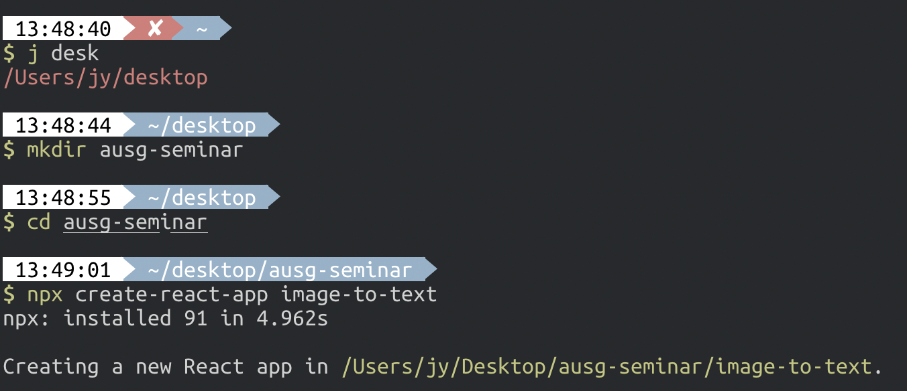

# create-react-app이란?

- 별도의 설정 없이 react를 쉽게 시작할 수 있게끔, 새 react 프로젝트를 생성할 수 있게끔 해 주는 도구!
- [create-react-app](https://github.com/facebook/create-react-app)

# create-react-app을 이용해서 새 React 프로젝트 생성하기

- 일단 create-react-app을 local 환경에 global로 설치하기 위해, 다음과 같은 명령어를 터미널에 입력합니다.

```bash
$ npm i -g create-react-app
혹은
$ yarn global add creat-react-app
```

- 다음과 같이 수행되었다면 성공적으로 패키지를 설치하신 겁니다!



- 이제, 이를 이용하여 새 react 프로젝트를 만들어 보겠습니다. 프로젝트를 생성하고자 하는 경로로 이동하셔서 다음과 같은 명령어를 터미널에 입력하시면 됩니다.

```bash
$ create-react-app image-to-text
```

- image-to-text는 임의로 작성한 폴더명으로, 원하시는 프로젝트명으로 변경하셔도 무관합니다.  
다음과 같이 성공적으로 react 프로젝트가 생성된 것을 보실 수 있습니다.


- 해당 프로젝트를 run 시켜보도록 하겠습니다.
```bash
$ cd image-to-text

$ npm run start
혹은
$ yarn start
```

- 다음과 같은 메세지가 보이신다면 성공적으로 react 프로젝트가 run되고 있는 것입니다. 이제 브라우져로 이동해서 `localhost:3000`으로 이동해봅시다.


- react가 local 환경에서 잘 띄워지고 있군요! 이제 이를 이용해서 개발할 차례입니다 :)


# Front-end 개발하기

- 이제 본격적으로 개발을 해보도록 하겠습니다. 말씀드렸다시피 이미지의 url을 받아, 해당 이미지 내 텍스트들을 추출해내는 프로젝트를 만들어 보려고 합니다. 그 전에, react에 대한 이해가 조금 필요합니다. 같이 ppt를 보시죠!


(React 설명중...)

- react에 대해 어느정도 이해가 되셨으리라 믿고, 이제 본격적으로 개발해볼건데요. 저희가 변경하거나 추가할 파일은 딱 2개뿐입니다.  
먼저, 프로젝트의 `src` 폴더 내에 `components` 폴더를 만들어 그 안에 `Form.jsx` 컴포넌트를 다음과 같이 작성한 후 저장합니다.


**/image-to-text/src/components/Form.jsx**

```javascript
import React from 'react'

export default class Form extends React.Component {
  state = {
    imageURL: ''
  }

  render() {
    return (
      <>
        <input
          placeholder="url"
          value={this.state.imageURL}
          onChange={this.onURLChanged}
        />
        <button onClick={this.onSubmitButtonClicked}>
          submit
        </button>
      </>
    )
  }

  onURLChanged = (e) => {
    this.setState({
      imageURL: e.target.value
    })
  }

  onSubmitButtonClicked = () => {
    // TODO: call server
    this.props.getResult(this.state.imageURL)
  }
}
```

- 완료하셨다면, 이제 `image-to-text/src/App.js` 로 이동해서, **기존의 `App.js` 내용을 모두 지운 후에 다음과 같이 입력합니다.**

**/image-to-text/src/App.js**

```javascript
import React from 'react'
import './App.css'
import Form from './components/Form'

export default class App extends React.Component {
  state = {
    isLoading: false,
    result: ''
  }

  render() {
    return (
      <div className="App">
        {this.state.isLoading ?
          <div>Loading....</div> : 
          <Form
            getResult={this.getResult}
            setLoadingStatus={this.setLoadingStatus}
          />
        }
        {this.state.result !== '' ?
          <div>{this.state.result}</div> : null
        }
      </div>
    )
  }

  setLoadingStatus = (status) => {
    this.setState({
      isLoading: status
    })
  }

  getResult = (result) => {
    this.setState({
      result
    })
  }
}
```

- 브라우져의 `localhost:3000`를 보시면 다음과 같이 변경되신 걸 보실 수 있습니다. 입력하여 바뀐 Form 내부의 state인 `imageURL`이 `App.js`가 props로 전달한 `getResult` 함수를 통해 `App.js`의 state인 `result`가 바뀌고 있네요.


## react 프로젝트 생성 및 설정을 모두 마쳤습니다!

- 구동중인 react 프로젝트는 중지시켜 주세요.
  - 터미널에서 ctrl+c로 중지하면 됩니다.

- 일단 프론트엔드의 틀은 어느 정도 만들어졌습니다. 서버를 완성한 후에, 서로 통신할 수 있게 되었을 때 react 프로젝트를 완성시키려고 합니다.

- 이제 [Express 프로젝트 생성하기](../3_express/README.md)로 넘어갑시다!