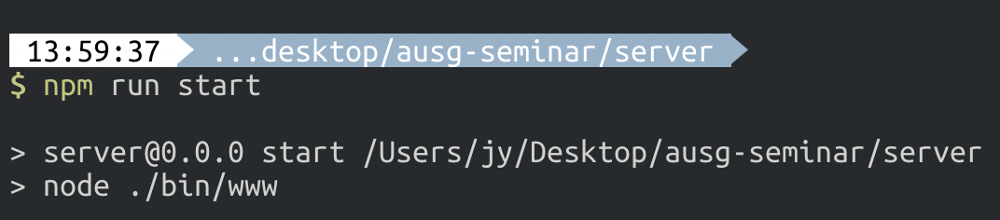

# express란?

- `node.js`를 기반으로 하며, `웹 서버`로 주로 이용하는 프레임워크!

# express-generator란?

- express 프로젝트를 쉽게 생성할 수 있게끔 해주는 도구!
- [express-generator](https://github.com/expressjs/generator)

# express-generator를 이용해서 새 express 프로젝트 생성하기

- 일단 express-generator을 local 환경에 global로 설치하기 위해, 다음과 같은 명령어를 터미널에 입력합니다.

```bash
$ npm i -g express-generator
혹은
$ yarn global add express-generator
```

- 다음과 같이 수행되었다면 성공적으로 패키지를 설치하신 겁니다!


- 이제, 이를 이용하여 새 express 프로젝트를 만들어 보겠습니다. 프로젝트를 생성하고자 하는 경로로 이동하셔서 다음과 같은 명령어를 터미널에 입력하시면 됩니다.

```bash
$ express server
```

- `server`는 임의로 작성한 폴더명으로, 원하시는 프로젝트명으로 변경하셔도 무관합니다.  
다음과 같이 성공적으로 express 프로젝트가 생성된 것을 보실 수 있습니다.


- 해당 프로젝트로 이동하여 필요한 패키지들을 설치하겠습니다.

```bash
$ cd server

$ npm install
혹은
$ yarn
```

- 이제 해당 프로젝트를 run 시켜보도록 하겠습니다.

```bash
$ npm run start
혹은
$ yarn start
```

- 다음과 같은 메세지가 보이신다면 성공적으로 express 프로젝트가 run되고 있는 것입니다. 이제 브라우져로 이동해서 `localhost:3000`으로 이동해봅시다.



- express가 local 환경에서 잘 띄워지고 있군요! 이제 이를 이용해서 개발할 차례입니다 :)


# Back-end 개발하기

이제 본격적으로 백엔드 개발을 시작하기 위해 필요한 패키지들을 설치하고, 몇가지 설정을 하도록 하겠습니다.  

## 패키지 설치

- 터미널에서 다음 명령어를 입력해서 3가지 패키지들을 설치합시다.

```bash
$ npm install aws-sdk axios cors
혹은
$ yarn add aws-sdk axios cors
```

- 다음과 같이 되셨다면 성공적으로 패키지를 설치하신 겁니다.


## 포트 번호 변경

앞으로 클라이언트와 서버가 통신하게 될텐데요. 이를 위해서는 두 프로젝트 모두 동시에 구동되는 상태어야 하는데, 둘 다 3000번 포트를 쓰고 있네요.  
이를 해결하기 위해 express의 포트 번호를 3001번으로 변경하도록 하겠습니다.

- `server/bin/www` 파일로 이동하여, 15번째 줄을 다음과 같이 변경합니다.

```javascript
var port = 3001;
```

- 이렇게 변경하면, `server/bin/www`는 다음과 같은 모습이 되겠네요.


## CORS 설정

### 잠깐! CORS란?

- 다른 origin으로 부터 요청이 오는 경우, `same-origin policy`에 의해 요청에 대한 응답이 오지 않습니다. (참고: [MDN](https://developer.mozilla.org/en-US/docs/Web/HTTP/CORS))
> Q: 그럼 저희는 왜 CORS 설정이 필요한가요? 클라이언트와 서버 모두 같은 local 환경이잖아요!  
A: orgin은 domain, protocol, port를 포함하는 개념이며, 현재 react 프로젝트는 3000번 포트에서, express 서버는 3001번 포트에서 구동되기 때문입니다.  

- `server` 내 `app.js` 파일로 이동한 후, 11번째 줄과 16번째 줄에 다음과 같이 추가합니다.

```javascript
// 11번째 줄
var cors = require('cors');

...

// 16번째 줄
app.use(cors());
```

- 이렇게 추가하게 되면, `app.js`는 다음과 같은 모습이 되겠네요.


## 드디어 개발!! router에 path 추가하기
앞서 말씀드렸다시피 서버는 `/detectImage`에 대해 `GET`요청을 받으면 AWS Rekognition을 이용하여 이미지 내 텍스트를 탐지하여 결과를 클라이언트에 전송해 주는 구조로 만들기로 했습니다. 이 부분을 만들어 봅시다.

- `server/routes/index.js`로 이동하여, **기존의 `server/routes/index.js` 내용을 모두 지운 후에 다음과 같이 입력합니다.**

```javascript
var express = require('express');
var router = express.Router();

const aws = require('aws-sdk')
// 리전을 설정합니다.
aws.config.update({ region: 'ap-northeast-2' })
const rekognition = new aws.Rekognition()

const axios = require('axios')

/* GET home page. */
router.get('/', function(req, res, next) {
  res.render('index', { title: 'Express' });
});

router.get('/detectImage', async (req, res, next) => {
  const imageURL = req.query.imageURL
  // 이미지 URL로부터 해당 이미지를 arraybuffer 형식으로 가져옵니다.
  const responseImage = await axios.get(
    imageURL,
    { responseType: 'arraybuffer' }
  )
  
  // rekognition의 detectText 함수에 필요한 parameter 변수입니다.
  const params = {
    Image: {
      Bytes: new Buffer(responseImage.data, 'binary')
    }
  }

  // 실제로 이미지로부터 텍스트를 추출해내는 작업을 수행하는 함수입니다.
  rekognition.detectText(params, (err, data) => {
    if (err) {
      res.status(200).send(
        {
          status: 400,
          detectionResult: err
        }
      )
    } else {
      res.status(200).send(
        {
          status: 200,
          detectionResult: data
        }
      )
    }
  })
})

module.exports = router;
```

> parameter 형식 등 자세한 사항은 [aws-sdk Rekognition API](https://docs.aws.amazon.com/AWSJavaScriptSDK/latest/AWS/Rekognition.html)을 참고하시면 됩니다.

## express 프로젝트 생성 및 설정을 모두 마쳤습니다!

- 구동중인 express 프로젝트는 중지시켜 주세요.
  - 터미널에서 ctrl+c로 중지하면 됩니다.

- 마지막으로 [통신하기](../4_connect/README.md)로 넘어가서 프로젝트를 완성합시다!
