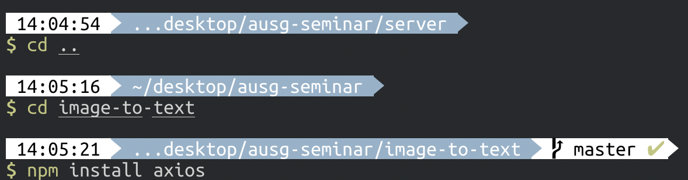

# 클라이언트와 서버간 서로 통신하기

- 이제 react 프로젝트를 수정하여, 클라이언트가 서버에 요청을 날려 이미지로부터 추출한 텍스트를 응답으로 받아오도록 합시다.

## 패키지 추가

- 클라이언트가 서버에 요청을 날리기 위해서, [axios](https://github.com/axios/axios)라는 패키지를 사용하겠습니다.

- 터미널에서 앞서 생성한 `react 프로젝트`로 이동하여, `axios`를 설치합시다.

```bash
$ cd image-to-text

$ npm install axios
혹은
$ yarn add axios
```

- 다음과 같이 수행하시면 됩니다.



## Form Component 수정

- `src/components/Form.jsx` 내에서 `axios`를 import 해야합니다.

- 또한, submit 버튼을 누르면 서버에 요청을 하도록 `onSubmitButtonClicked` 함수를 수정합시다.

- 이외의 다른 부분은 그대로 두시면 됩니다.

**src/components/Form.jsx**

```javascript
import React from 'react'
// [추가] axios를 import 합니다.
import axios from 'axios'

// ...

// [변경] 기존 onSubmitButtonClicked 함수를 삭제하고, 아래 내용으로 다시 작성해주세요.
onSubmitButtonClicked = async () => {
  // 로딩 상태로 변경합니다.
  this.props.setLoadingStatus(true)
  // express 서버에 imageURL에 대해 요청합니다.
  const result = await axios.get(
    'http://localhost:3001/detectImage/?imageURL=' + encodeURIComponent(this.state.imageURL)
  )
  // 결과를 받아옵니다.
  const detectionResultArray = result.data.detectionResult.TextDetections
  console.log('result', result)
  // App.js에 result로 전달합니다.
  this.props.getResult(detectionResultArray)
  // 로딩 상태를 해제합니다.
  this.props.setLoadingStatus(false)
}
```

## App.js 수정

- `src/App.js` 내에서도 서버에서 제공하는 결과에 맞게 렌더링하기 위해 수정이 필요합니다.

- 기존 `src/App.js`의 `render`함수 내에서 아래 코드 부분을 삭제합니다.

```javascript
// ...

{this.state.result !== '' ?
  <div>{this.state.result}</div> : null
}

// ...
```

- 삭제한 부분을 아래 내용으로 채우시면 됩니다.

```javascript
{this.state.result !== '' ?
  this.state.result.map((result, index) => (
    <div key={index}>
      <h3>{result.Type}</h3>
      <div>{result.DetectedText}</div>
    </div>
  ))
  : null
}
```

> Q: 왜 이렇게 바꾸나요?  
A: AWS Rekognition의 detectText 후의 결과가 object들의 array로 넘어옵니다. 따라서 그에 맞게 렌더링 형식을 바꿔 준 것입니다.

## 개발 완료!! 이제 클라이언트와 서버 모두 구동해봅시다.

- 2개의 터미널 창을 여시고, 1개의 창에는 react 프로젝트가 있는 곳으로 이동해주시고 나머지 1개의 창에서는 express 프로젝트가 있는 곳으로 이동해주세요.

- 2개의 창 둘 다 다음 명령어를 수행하여 react와 express 프로젝트를 구동합시다.

```bash
$ npm run start
혹은
$ yarn start
```

- 브라우져를 열어 `localhost:3000` 으로 이동합시다. 아까와 같은 모습인 것을 보실 수가 있습니다.


- url을 입력하는 칸에 이미지 URL를 입력하시면 되는데, [unsplash](https://unsplash.com/)의 이미지를 이용하시는 것을 권장드립니다.
> Q: 왜죠?  
A: 임의로 텍스트 이미지를 찾으시면 해당 이미지를 제공하는 서버에서 CORS를 허용하지 않고 있을 수 있기 때문입니다.

- unsplsh로 이동하여, 텍스트가 포함된 이미지를 찾아 그 이미지의 url을 다음과 같이 복사합니다.


- 복사한 url을 `localhost:3000`의 input 태그 값으로 입력하여 submit 버튼을 누르면 다음과 같이 수행됩니다.


## 프로젝트를 모두 마쳤습니다! 수고하셨습니다 :)

- 집에 가셔서 [더 도전해볼만한 것](../5_advanced/README.md)을 준비했습니다.
