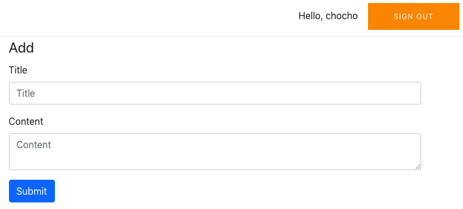

### Install the CLI

```bash
$ npm install -g @aws-amplify/cli
$ amplify configure
```

### amplify configure 후

- AWS 콘솔 창이 열리면, AWS 콘솔 로그인

- 터미널로 돌아와서

  - `Enter`
  - 리전 `ap-northeast-2` (서울)로 지정
  - IAM 유저 생성
    - `user name` : **ausg-amplify** 입력

- AWS 콘솔에서 다음과 같이 설정

  - 

* 

- **다음** - **다음** - **사용자 만들기** 클릭

* 빨간 네모 안의 내용들을 `.csv 다운로드` 하거나, 창을 그대로 놔두고 터미널로 이동합니다!
  

- 터미널에서

  - `Enter`
  - 
    - `accessKeyId`에는 `액세스 키 ID`, `secretAccessKey`에는 `비밀 액세스 키`를 넣어주세요.
    - 새 유저가 만들어졌습니다!

### IAM 권한 설정

- 

  - 이 창을 그대로 열어두셨다면, `닫기` 버튼을 눌러주세요.

  - 이 창을 닫으셨다면,

    **콘솔** - **서비스** - **IAM 검색** - **사용자**

- 

- 

#### CloudFormation 정책 추가하기

1. 
2. 
3. 
4. 
5. **권한 추가**

- 1~5번을 아래와 같이 5번 더 반복합니다!

  - Cognito Identity

  - Cognito User Pools

    

  - IAM

    

  - Lambda

    

  - S3

    

* **정책 검토** 버튼을 클릭합니다

  - 
    - 정책의 **이름을 입력** 하고, `요약` 의 내용이 스크린샷과 동일한지 확인합니다.

* **정책 생성** 버튼을 클릭합니다

### create a new app

- 터미널에서

  - ```bash
    $ npm install -g create-react-app
    $ create-react-app ausgapp && cd ausgapp
    // 기본적으로 다운로드되는 패키지 저장소의 오류가 있을 경우에는 node_modules와 package-lock.json 파일을 삭제하고
    // 다음을 진행해주세요.
    $ rm -rf node_modules package-lock.json
    // 윈도우에서는 'del /s /q node_modules'과 'del package-lock.json'를 이용해 삭제할 수 있습니다.
    $ npm start
    ```

- 

### install Amplify

- `ctrl + C`

- react app의 root directory에서

- ```bash
  $ npm install --save aws-amplify
  $ npm install --save aws-amplify-react
  ```

### Set Up the AWS Backend

- amplify init 하기

  ```bash
  $ amplify init
  ```

- 아래와 같이 작성해줍니다
  ( `environment : dev`, `editor : Visual Studio Code` 를 제외하고는 다 엔터! )

  

* **? Do you want to use an AWS profile?** (Y/n)를 물으면 **Y** 입력 후 엔터

* **ausg-amplify** 선택

### Implementing Authentication

```bash
$ amplify add auth
```

- **Do you want to use the default authentication and security configuration?**
  - **Default configuration** 선택
- **How do you want users to be able to sign in when using your Cognito User Pool?**
  - **Username** 선택
- **What attributes are required for signing up?**
  - **Email** 선택

```bash
$ amplify push
```

- **Are you sure you want to continue?**
  - **Yes** 입력

### Adding Authentication to the React App

- **src/index.js** 수정

  ```react
  //파일의 맨 위에 추가
  import Amplify from 'aws-amplify'
  import config from './aws-exports'

  //import 구문들 아래에
  Amplify.configure(config)
  ```

* **src/App.js** 수정

  ```react
  //파일의 맨 위에 추가
  import { withAuthenticator } from 'aws-amplify-react'

  //파일의 맨 밑 줄 대체
  export default withAuthenticator(App);
  ```

### 앱 실행

```bash
// Build Command
$ npm run-script build
// Start Command
$ npm run-script start
```


- Create account —> 작성한 **이메일** 로 온 인증코드 입력 —> 로그인

## Cognito 살펴보기


- AWS 콘솔 - 서비스 - Cognito 검색


- 사용자 풀 관리 클릭


- 우리가 만들어 둔 사용자 풀! 클릭합니다

### 속성


- 왼쪽 메뉴에서 일반 설정 - 속성을 클릭합니다


- `amplify add auth`시 설정했던 사항들 확인 가능! (**변경 불가**)

### 정책


- 왼쪽 메뉴에서 일반 설정 - 정책을 클릭합니다.


- 암호 강도, 사용자 가입 허용 여부 등을 설정할 수 있습니다.

- 여러분들은 `사용자가 가입할 수 있도록 허용` 상태일 텐데요,

  

  저는 `관리자만 사용자를 생성할 수 있도록 허용` 으로 바꿔보겠습니다!

  콘솔에서 `변경 내용 저장` 을 누른 후, 터미널에서 `npm run-script start` 또는 `npm start` 를 실행해보겠습니다.

- 

  위와 같이, `CREATE ACCOUNT` 버튼을 클릭하면 `A client attempted to write unauthorized attribute` 오류가 뜨는 것을 볼 수 있네요!

## Backend

### Creating The Serverless Backend Services

```bash
// 프로젝트의 루트 디렉토리에서
$ amplify add api
```

- **? Please select from one of the below mentioned services**
  - `REST` 선택
- **? Provide a friendly name for your resource to be used as a label for this category in the project**
  - `todoAPI` 입력
- **? Provide a path (e.g., /items)**
  - `Enter`
- **? Choose a Lambda source**

  - `Create a new Lambda function` (Enter)

- **? Provide a friendly name for your resource to be used as a label for this category in the project**
  - `todoLambda` 입력
- **? Provide the AWS Lambda function name**
  - `todo` 입력
- **? Choose the function template that you want to use**
  - `CRUD function for Amazon DynamoDB table (Integration … )` 선택
- **? Choose a DynamoDB data source option**
  - `Create a new DynamoDB table` 선택


#### NoSQL DynamoDB database wizard

로 진입했습니다! wizard를 사용해서 NoSQL 데이터베이스 테이블 세팅을 해 봅시다!

- **? Please provide a friendly name for your resource that will be
  used to label this category in the project**
  - `todoTable` 입력
- **? Please provide table name**
  - `todo` 입력


테이블에 column을 추가 해 봅시다.

- **? What would you like to name this column**
  - `id`
- **? Please choose the data type**
  - `string`
- **? Would you like to add another column?**
  - `No`


데이터베이스를 생성하기 전에, Primary key를 정해줍니다.

> Primary key : 데이터베이스 설계자나 관리자는 여러 후보키 중에서 기본적으로 사용할 키를 반드시 선택해야 하는데 이것이 기본키(**primary key**)


그 후에 secondary indexes를 설정할거냐고 물어보는데, n을 입력 해 줍니다.


**Succesfully added DynamoDb table locally** 메세지가 나와야 합니다!

Local lambda function 을 수정할거냐고 묻는데, n을 입력 해 줍니다.


API에 접근하는 것을 제한할지 묻는데, y를 입력 후 아래와 같이 진행해줍니다.


> `a` 를 눌러 전체선택 해준 후 엔터를 눌러줍니다

unauthenticated users, 즉 Guest 유저에게는 `read` 권한만 부여 해 줍니다.

space 를 눌러서 선택 후 엔터를 눌러줍니다.


**Successfully updated auth resource locally** 메세지가 나와야 합니다!

API에 다른 path를 추가할지 묻는데, n을 입력 해 줍니다.


**Successfully added resource todoAPI locally** 라는 메세지가 나오면 끝납니다!

### amplify add api

`amplify add api` 라는 명령어로 REST API를 생성해 봤는데요, 이 API를 만들기 위해서 4가지 AWS

서비스가 사용되었습니다! 그 4가지 서비스를 살펴보도록 할게요.

1. Amazon DynamoDB
   - NoSQL 데이터베이스로 제공됨
   - `todoTable` 리소스를 추가했을 때 `todo`라는 DynamoDB 테이블을 만듦
   - `id`가 primary key인 3개의 columns
2. AWS Lambda functions
   - 서버관리나 프로비저닝 없이 코드를 실행할 수 있게 해줌
   - DynamoDB 테이블에서 CRUD 동작이 일어나는 부분
3. Amazon Cognito
   - authentication , user management 를 위해 필요
   - 회원가입, 로그인, 접근 제한
4. Amazon API Gateway
   - REST API endpoint를 만들게 해 줌
   - path가 `item` 인 리소스! 이름은 `todoApi`

### 권한 추가

Lambda, Cognito는 아까 IAM 권한을 추가 해 줬는데, DynamoDB와 API Gateway는 추가해 주지 않은 상태입니다! 아까와 같은 방식으로 추가 해 줍니다

- DynamoDB


- API Gateway


- 요약의 내용이 아래와 같은지 확인합니다.


그런데, 지금 이런 서비스들의 세부사항이 클라우드에 올라가지 않은 상태입니다.

먼저, 명령어 `amplify status`를 실행합니다.

> amplify 프로젝트에 대한 정보를 표로 보여줍니다


> API set up 과정에서 설정한 정보들은
>
> 프로젝트 root 폴더에서 amplify/backend/function/todoLambda/src/app.js 에서 확인 및 수정이 가능합니다!

Operation에 Create, Update 등 클라우드에 반영되지 않은 내용을 확인할 수 있습니다!

(클라우드와 비교해 변화가 없다면 No Change로 표시됩니다.)

`amplify push` 명령어로 클라우드에도 반영해 줍니다. (y를 눌러줍니다)

### Building The Frontend

`amplify push` 명령어가 정상적으로 수행됐다면, **src** 폴더에 **aws-exports.js** 파일이 생긴 것을 보실 수 있습니다!

이 파일은 클라우드에 생성된 리소스들의 정보를 담고 있어요. push 명령어가 수행될 때 마다 업데이트됩니다.

이 파일은 JavaScript 프로젝트를 위해 만들어진 파일이고, Amplify JavaScript library에서 사용됩니다.

이 파일을 사용해서 React 프로젝트를 만들어 봅시다!

#### public/index.html 파일을 열어줍니다

**\<head> 와 \</head> 사이에** 아래 코드를 복사 해 붙여넣어 줍니다.

```html
<link
  rel="stylesheet"
  href="https://stackpath.bootstrapcdn.com/bootstrap/4.1.3/css/bootstrap.min.css"
  integrity="sha384-MCw98/SFnGE8fJT3GXwEOngsV7Zt27NXFoaoApmYm81iuXoPkFOJwJ8ERdknLPMO"
  crossorigin="anonymous"
/>
<script
  src="https://code.jquery.com/jquery-3.3.1.slim.min.js"
  integrity="sha384-q8i/X+965DzO0rT7abK41JStQIAqVgRVzpbzo5smXKp4YfRvH+8abtTE1Pi6jizo"
  crossorigin="anonymous"
></script>
<script
  src="https://cdnjs.cloudflare.com/ajax/libs/popper.js/1.14.3/umd/popper.min.js"
  integrity="sha384-ZMP7rVo3mIykV+2+9J3UJ46jBk0WLaUAdn689aCwoqbBJiSnjAK/l8WvCWPIPm49"
  crossorigin="anonymous"
></script>
<script
  src="https://stackpath.bootstrapcdn.com/bootstrap/4.1.3/js/bootstrap.min.js"
  integrity="sha384-ChfqqxuZUCnJSK3+MXmPNIyE6ZbWh2IMqE241rYiqJxyMiZ6OW/JmZQ5stwEULTy"
  crossorigin="anonymous"
></script>
```

- Bootstrap을 사용합니다!


#### src/Details.js 파일을 만들어줍니다

```javascript
import React from "react"
export default props => (
  <div>
    <h2>Details</h2>
    <div className="btn-group" role="group">
      <button
        type="button"
        className="btn btn-secondary"
        onClick={props.loadListPage}
      >
        Back to List
      </button>
      <button
        type="button"
        className="btn btn-danger"
        onClick={() => props.delete(props.item.id)}
      >
        Delete
      </button>
    </div>
    <legend>{props.item.title}</legend>
    <div className="card">
      <div className="card-body">{props.item.content}</div>
    </div>
  </div>
)
```

- 삭제 버튼, item의 세부사항을 표시해주는 컴포넌트입니다

#### src/App.js 파일을 열고 덮어 써 줍니다

```javascript
import React, { Component } from "react"
import Details from "./Details"
import Amplify, { API } from "aws-amplify"
import aws_exports from "./aws-exports"
import { withAuthenticator } from "aws-amplify-react"
Amplify.configure(aws_exports)

class App extends Component {
  constructor(props) {
    super(props)
    this.state = {
      content: "",
      title: "",
      item: {},
      showDetails: false
    }
  }
  handleChange = event => {
    const id = event.target.id
    this.setState({ [id]: event.target.value })
  }
  handleSubmit = async event => {
    event.preventDefault()
    await API.post("todoAPI", "/items", {
      body: {
        id: Date.now().toString(),
        title: this.state.title,
        content: this.state.content
      }
    })
      .then(response => {
        console.log(response)
      })
      .catch(error => {
        console.log(error)
      })
    this.setState({ content: "", title: "" })
  }
  loadDetailsPage = async id => {
    const response = await API.get("todoAPI", "/items/" + id)
    this.setState({ item: { ...response }, showDetails: true })
  }

  delete = async id => {
    //TODO: Implement functionality
  }
  render() {
    return (
      <div className="container">
        <form onSubmit={this.handleSubmit}>
          <legend>Add</legend>
          <div className="form-group">
            <label htmlFor="title">Title</label>
            <input
              type="text"
              className="form-control"
              id="title"
              placeholder="Title"
              value={this.state.title}
              onChange={this.handleChange}
            />
          </div>
          <div className="form-group">
            <label htmlFor="content">Content</label>
            <textarea
              className="form-control"
              id="content"
              placeholder="Content"
              value={this.state.content}
              onChange={this.handleChange}
            />
          </div>
          <button type="submit" className="btn btn-primary">
            Submit
          </button>
        </form>
        <hr />
        {this.state.showDetails && (
          <Details item={this.state.item} delete={this.delete} />
        )}
      </div>
    )
  }
}
export default withAuthenticator(App, true)
```


#### tableName 수정하기

프로젝트의 root 폴더에서 **amplify/backend/function/todoLambda/src/app.js** 를 열어줍니다

```javascript
//at line 17
let tableName = "todoTable";
// 이 부분을 아래와 같이 고쳐줍니다.

let tableName = "todo";

```

DynamoDB 리소스를 만들 때, 리소스 이름을 todoTable로, 테이블 이름을 todo로 정해줬었습니다.

파일이 생성될 때 리소스 이름이 테이블 이름으로 잘못 사용되었는데요, 이를 고쳐주는 작업입니다!

CLI가 업데이트 될 때 고쳐질 것으로 보이는데, 나중에 이 문서를 보고 따라하시는 분들 중 틀린 부분이 없으시다면 이 과정은 건너뛰시면 됩니다.


`amplify push`

`npm start`



위와 같은 화면이 보이신다면 성공입니다!


Title과 Content를 입력 후 Submit 버튼을 눌러주세요. 이제 입력한 내용이 DB상에 잘 올라갔는지 확인 해 보겠습니다!


### DB 확인하기

콘솔 - DynamoDB - 테이블 - **todo-ausg** 선택 - 항목 탭에 들어가주세요!


입력한 내용이 추가된 모습입니다.


## 리소스 삭제하기

터미널에서 `amplify delete`를 수행해주세요!

**? Are you sure you want to continue?(This would delete all the environments of the project from the cloud and wipe out all the local amplify resource files)** 에 `Yes` 를 입력합니다

이번 세션에서 사용한 리소스가 모두 삭제됩니다!

성공 메세지(**Project deleted locally.**)를 확인해주세요.