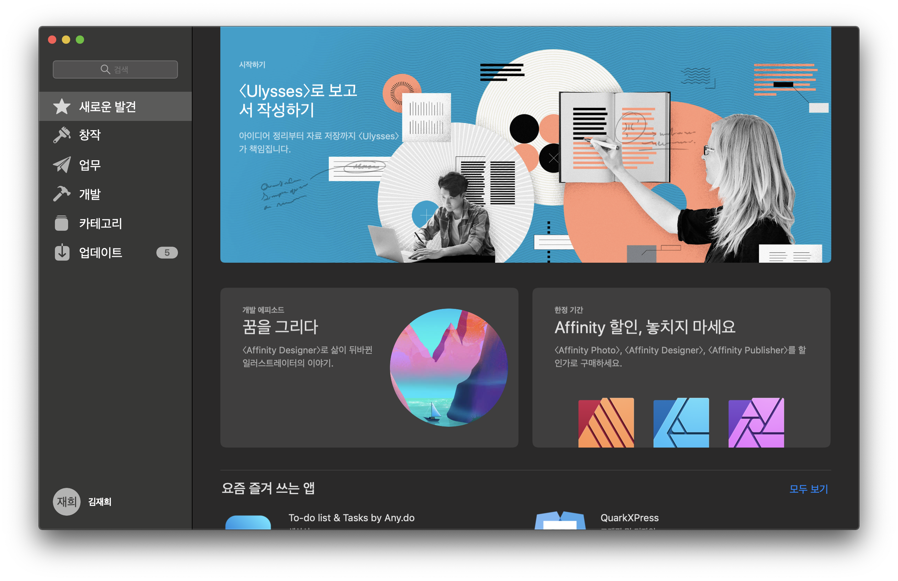
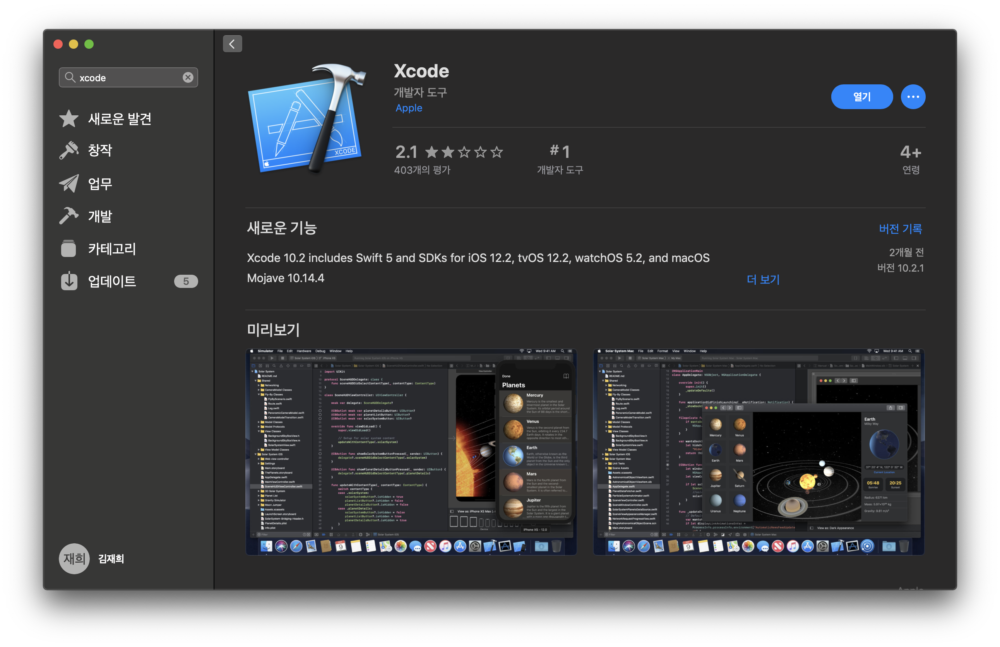
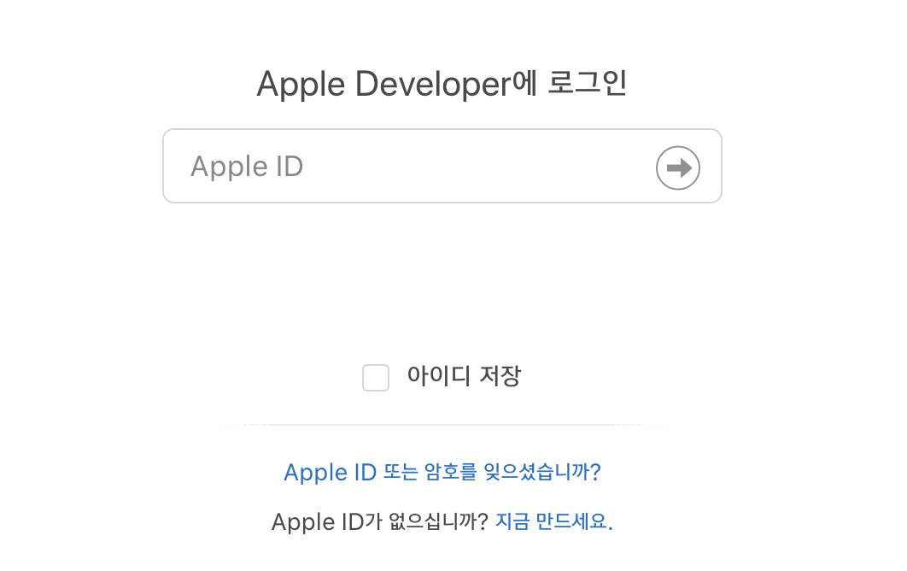
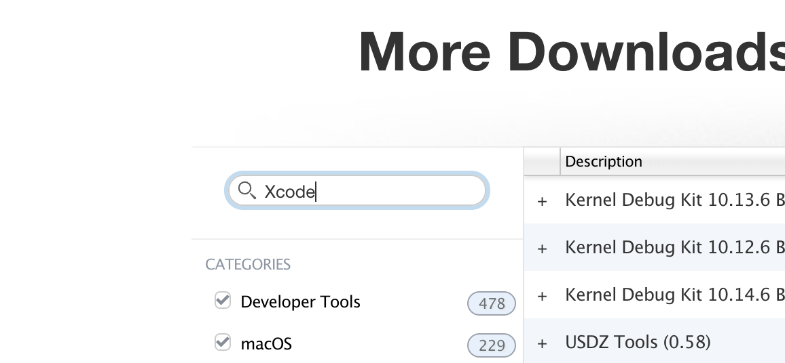
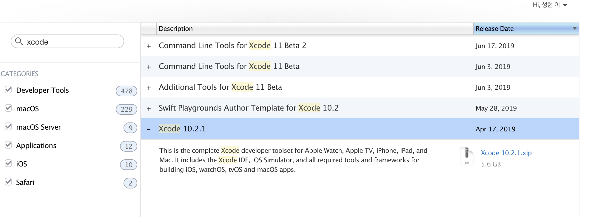

# iOS 개발환경 설정 🍎

iOS 개발 시작을 위해 개발환경을 설정해보겠습니다.🙌
`MAC` 환경을 대상으로 진행됩니다.

## 설치 순서

### 1. Xcode 설치
### 2. CocoaPods 설치 및 사용 방법 안내
### 3. Simulator 설치 (선택)
### 4. 아이폰 개발자 설정 (선택)

설치는 위 순서대로 진행되며 이미 설치되어 있는 과정은 넘어가셔도 됩니다!


### 아이폰을 소유하지 않으신다면 3번 과정을 
###아이폰을 소유하신다면 4번 과정을 진행하시면 됩니다.  
---

## 1. Xcode 설치

### 1. 앱스토어 설치


### 2. 애플 개발자 페이지에서 설치
https://developer.apple.com/download/more/ 

#### 애플 계정 로그인




## 2. CocoaPods 설치 및 사용 방법 안내

iOS 앱을 개발하면서 외부 라이브러리의 필요성을 느끼게 되고, 여러 라이브러리를 사용하다보면 서로 의존성이 꼬이는 문제가 발생할 수 있습니다.

이런 문제를 해결하기 위해 사용하는 `CocoaPods`는 `Swift` 및 `Objective-C` 코코아 프로젝트의 종속성 관리자입니다.


iOS 첫 세션인 `별점에 따라 표시가 다른 맛집 지도 만들기` 에서는 `Google Map`이라는 외부 라이브러리를 사용해야 하기 때문에 `CocoaPods` 설치가 필요합니다.


`터미널(Terminal)`에 아래 두줄을 차례로 입력해주시면 됩니다!

```
$ sudo gem install cocoapods
$ pod setup
```

설치 하는데에 시간이 꽤 걸릴 수 있으므로 세미나 전 미리 개인 노트북에 설치 부탁드립니다. 😊


## 3. Simulator 설치 (선택)


## 4. 아이폰 개발자 설정 (선택)

