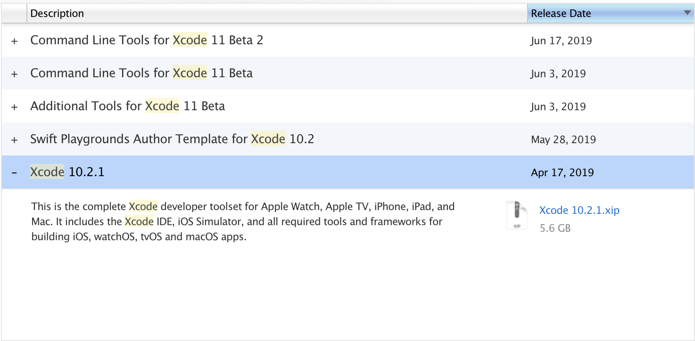

# iOS 개발환경 설정 🍎

iOS 개발 시작을 위해 개발환경을 설정해보겠습니다.🙌
`MAC` 환경을 대상으로 진행됩니다.

## 설치 순서

### 1. Xcode 설치
### 2. CocoaPods 설치 및 사용 방법 안내
### 3. Simulator 설치 (선택)
### 4. 아이폰 개발자 설정 (선택)

설치는 위 순서대로 진행되며 이미 설치되어 있는 과정은 넘어가셔도 됩니다!


### 아이폰을 소유하지 않으신다면 3번 과정을 
### 아이폰을 소유하신다면 4번 과정을 진행하시면 됩니다.  
---

## 1. Xcode 설치
2가지 방법 중 원하시는 방법으로 최신 버전의 Xcode를 설치해주시면 됩니다.
### 1. 앱스토어 설치
#### 앱스토어 접속
앱스토어에 들어갑니다.


#### Xcode 검색 후 설치
앱스토어 왼쪽 상단에 검색창에 `Xcode`라고 검색 후 설치버튼을 클릭하면 설치가 완료됩니다.


### 2. 애플 개발자 페이지에서 설치
#### 애플 개발자 페이지 접속
아래 페이지에 접속합니다.
https://developer.apple.com/download/more/ 
#### 애플 계정 로그인
애플 계정이 있어야 해당 페이지에 접속이 가능합니다. 애플 계정으로 로그인합니다.


#### Xcode 검색
왼쪽 상단에 검색창에 `Xcode`라고 검색합니다.


#### Xcode 10.2.1 다운로드
`Xcode 10.2.1` 을 클릭하여 오른쪽 파일을 다운로드합니다.



#### 아카이브 유틸리티 압축 해제
다운로드 된 아카이브 유틸리티를 압축 해제합니다.


#### Xcode 설치 완료
Xcode가 설치 완료되면 `응용프로그램` 폴더로 이동시키면 완료입니다. 😎

---

## 2. CocoaPods 설치 및 사용 방법 안내

iOS 앱을 개발하면서 외부 라이브러리의 필요성을 느끼게 되고, 여러 라이브러리를 사용하다보면 서로 의존성이 꼬이는 문제가 발생할 수 있습니다.

이런 문제를 해결하기 위해 사용하는 `CocoaPods`는 `Swift` 및 `Objective-C` 코코아 프로젝트의 종속성 관리자입니다.


iOS 첫 세션인 `별점에 따라 표시가 다른 맛집 지도 만들기` 에서는 `Google Map`이라는 외부 라이브러리를 사용해야 하기 때문에 `CocoaPods` 설치가 필요합니다.

### 1. CocoaPods 설치
`터미널(Terminal)`에 아래 두줄을 차례로 입력해주시면 됩니다!

```
$ sudo gem install cocoapods
$ pod setup
```

설치 하는데에 시간이 꽤 걸릴 수 있으므로 세미나 전 미리 개인 노트북에 설치 부탁드립니다. 😊

### 2. CocoaPods 사용 방법
CocoaPods 설치가 완료되면 의존성 관리를 할 Xcode 프로젝트 폴더에서 터미널 명령을 실행해야 합니다.

**설치가 끝난 후 첫 iOS 프로젝트를 만들어 보실 수 있도록 간단한 샘플 프로젝트를 포함해두었습니다!**

해당 폴더로 이동합니다

```
$ cd [FirstiOSApp 프로젝트 폴더]
```

#### Podfile 생성
해당 폴더로 이동하여 아래 명령을 입력하면 Podfile이 생성됩니다.
```
$ pod init
```

#### Podfile 편집
Podfile을 편집합니다.
```
$ vi Podfile
```

사용하고 싶은 라이브러리 명을 입력합니다.  이 때 정해진 형식을 꼭 지켜주셔야 합니다.
(편집 사용 시 `i`, 저장하고 종료 시 `esc`+ `wq` 입력후 엔터)

```swift
# Uncomment the next line to define a global platform for your project
# platform :ios, '9.0'

target 'FirstiOSApp' do
  # Comment the next line if you're not using Swift and don't want to use dynamic frameworks
  use_frameworks!
  // 라이브러리 입력 부분
  pod 'GoogleMaps'
  pod 'GooglePlaces'
  //
  # Pods for FirstiOSApp

end
```

#### 라이브러리 설치
Podfile에서 명시한 라이브러리들을 설치합니다.
```
$ pod install
```

#### workspace 파일 확인
처음 `pod install`을 하게 되면 `프로젝트명.xcworkspace` 파일이 생성되는 것을 볼 수 있습니다!
라이브러리를 사용 시에는 `workspace` 파일을 열어서 작업해주세요.


라이브러리 수정 시 `Podfile 편집`부터 다시 진행해주시면 됩니다.

---

## 3. Simulator 설치 
예제 프로젝트를 실행시켜보기 위해 Simulator를 설치해 보겠습니다!

#### 프로젝트 실행
프로젝트 실행 후 아래 표시된 부분을 클릭합니다.


#### Download Simulators... 

`Download Simulators… `를 클릭합니다.


#### Simulators 설치
원하는 버전의 시뮬레이터를 설치하면 되는데 이번 실습에서는 `iOS 12.0 Simulator`를 설치하겠습니다.


설치 시간이 오래 걸릴 수 있으니 세미나 중 Simulator 사용을 원하시는 분들을 꼭 미리 설치해서 오시면 원활한 진행 가능할 것 같습니다. 🙂

#### 프로젝트 실행
시뮬레이터 설치 후 원하는 시뮬레이터를 선택한 후 (아래 화면에서는 iPhone XR) `왼쪽 화살표 버튼(Run)` 또는 `command` + `R`을 입력하여  프로젝트를 실행할 수 있습니다.


## 4. 아이폰 개발자 설정 


```

```