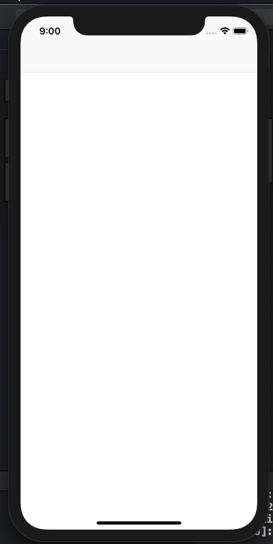

## npm 설치

[node.js](https://nodejs.org/en/download/) 와 [npm](https://www.npmjs.com/get-npm)이 미리 설치가 되어있어야합니다!

```
$ node --version // 8.10.0 이상 필요
v8.10.0
$ npm --version // 5.2 이상 필요
6.9.0
$ aws --version
//aws cli가 설치가 되어 있지 않으신 분들은 아래에서 같이 설치를 진행하도록 하겠습니다
aws-cli/1.16.163 Python/2.7.10 Darwin/18.5.0 botocore/1.12.153
```


## 프로젝트 만들기


xcode에서 **Single View App** 을 만들어줍니다


위와 같이 설정하고 Next를 눌러줍니다.


## Amplify 설치

### Install the CLI

```bash
$ npm install -g @aws-amplify/cli
$ amplify configure
```


### amplify configure 후

- AWS 콘솔 창이 열리면, AWS 콘솔 로그인
- 터미널로 돌아와서 
  - `Enter`
  - 리전 `ap-northeast-2` (서울)로 지정
  - IAM 유저 생성
    - `user name` : **ausg-amplify** 입력

* AWS 콘솔에서 다음과 같이 설정

  * 

* 

  

* **다음** - **다음** - **사용자 만들기** 클릭

  

  * 빨간 네모 안의 내용들을 `.csv 다운로드` 하거나, 창을 그대로 놔두고 터미널로 이동합니다!
    

  

- 터미널에서
  - `Enter`
  - 
    - `accessKeyId`에는  `액세스 키 ID`, `secretAccessKey`에는 `비밀 액세스 키`를 넣어주세요.
    - 새 유저가 만들어졌습니다!
  - 만약 **This would update/create the AWS Profile in your local machine** 이라는 문구가 뜨면 `ausg-amplify`를 한번 더 입력해주세요.


### IAM 권한 설정

- 

  - 이 창을 그대로 열어두셨다면, `닫기` 버튼을 눌러주세요.

  - 이 창을 닫으셨다면,

    **콘솔** - **서비스** - **IAM 검색** - **사용자** 

- 

- 


#### CloudFormation 정책 추가하기

1. 
2. 
3. 
4. 
5. **권한 추가**


- 1~5번을 아래와 같이 5번 더 반복합니다!

  - Cognito Identity

  - 

  - Cognito User Pools

    

  - IAM

    

  - Lambda

    

  - S3

    

    

- **정책 검토** 버튼을 클릭합니다

  - 
    - 정책의 **이름을 입력** 하고, `요약` 의 내용이 스크린샷과 동일한지 확인합니다.

- **정책 생성** 버튼을 클릭합니다


### install Amplify

- `ctrl + C`

- ios project의 root directory에서

- ```bash
  $ npm install --save aws-amplify
  ```


### Set Up the AWS Backend

- 프로젝트 폴더 경로로 이동해서 amplify init 하기

  ```bash
  $ amplify init
  ```

- 아래와 같이 작성해줍니다 
  ( `environment : dev`, `editor : Visual Studio Code` 를 제외하고는 다 엔터! )

  

- **? Do you want to use an AWS profile?** (Y/n)를 물으면 **Y** 입력 후 엔터

- **ausg-amplify** 선택


### Implementing Authentication

```bash
$ amplify add auth
```

- **Do you want to use the default authentication and security configuration?**
  - **Default configuration** 선택
- **How do you want users to be able to sign in when using your Cognito User Pool?**
  - **Username** 선택
- **Do you want to configure advanced settings? (Use arrow keys)**
  - **Yes, I want to make some additional changes.** 선택
- **What attributes are required for signing up?**
  - **Email** 선택
- **Do you want to enable any of the following capabilities?** 
  - `Enter`


```bash
$ amplify push
```

- **Are you sure you want to continue?**
  - **Yes** 입력


### Cocoapods

```bash
$ pod init
```


* Podfile 수정 (텍스트 편집기로 열어주세요)

  ```
  # Uncomment the next line to define a global platform for your project
  # platform :ios, '9.0'
  
  target 'iosAmplify' do
    # Comment the next line if you're not using Swift and don't want to use dynamic frameworks
    use_frameworks!
  
    # Pods for iosAmplify
    pod 'AWSUserPoolsSignIn'
    pod 'AWSAuthUI'
    pod 'AWSMobileClient'
  
  end
  ```


Podfile 저장 후 

```bash
$ pod install
```


### Add awsconfiguration.json to project

xcode에서 iosAmplify.xcodeproj 파일을 추가해줍니다

**iosAmplify.xcodeproj가 아닌 iosAmplify.xcworkspace 로 열어주세요! (Cocoapods를 사용하기 때문)**


### modify AppDelegate.swift

AppDelegate.swift 파일을 열어줍니다.

> AppDelegate가 무슨 파일인지는 [여기](https://zeddios.tistory.com/218) 를 참고해주세요.

```swift
//import문 추가
import AWSMobileClient
```

```swift
//함수 추가
func application(_ application: UIApplication, open url: URL, sourceApplication: String?, annotation: Any) -> Bool{
        
        return AWSMobileClient.sharedInstance().interceptApplication(application, open: url, sourceApplication: sourceApplication, annotation: annotation)
        
    }
```

```swift
//함수 수정
func application(_ application: UIApplication, didFinishLaunchingWithOptions launchOptions: [UIApplication.LaunchOptionsKey: Any]?) -> Bool {
        // Override point for customization after application launch.
        return AWSMobileClient.sharedInstance().interceptApplication(application, didFinishLaunchingWithOptions: launchOptions)
        
    }
```


ViewController.swift 파일을 열어줍니다.

```swift
import UIKit

//import문 추가
import AWSAuthCore
import AWSAuthUI

class ViewController: UIViewController {

    override func viewDidLoad() {
        super.viewDidLoad()
        // Do any additional setup after loading the view.
        
        //추가
        showSignIn()
    }
    
    //추가
    func showSignIn() {
        if !AWSSignInManager.sharedInstance().isLoggedIn {
            AWSAuthUIViewController.presentViewController(with: self.navigationController!, configuration: nil, completionHandler: { (provider: AWSSignInProvider, error: Error?) in
                if error != nil {
                    print("Error occured: \(String(describing: error))")
                }else{
                    print("Logged in with provider: \(provider.identityProviderName) with Token: \(provider.token())")
                }
            })
        }
    }


}

```


스토리보드에 가서 Editor - Embed In - Navigation Controller를 추가해줍니다


프로젝트를 빌드해주세요!


### 실습


초기 화면입니다.


회원가입을 하지 않고 로그인을 시도해보면,


유저가 없다는 오류가 뜹니다.


**Create new account** 버튼을 눌러 회원가입을 해줍시다!


네 항목을 채워줍니다.

핸드폰 번호는 **+821012341234** 형식으로 작성해주세요!


Confirmation code가 담긴 이메일을 확인해주세요.


회원가입이 성공적으로 완료되었습니다!


로그인 후 우리의 view controller가 보이는 모습입니다 :>


# 페이스북으로 로그인


**https://developers.facebook.com** 에 접속해 로그인 해주세요.


로그인 된 모습입니다.


 앱의 이름과 이메일을 적어주신 후 `앱 ID 만들기`를 눌러주세요


왼쪽 메뉴에서


설정-기본 설정을 들어가주세요.


스크롤을 내려 플랫폼 추가를 눌러주세요.


`iOS` 를 선택합니다


`번들ID` 항목을 채워주세요.


번들 ID란 xcode 프로젝트에서 저 부분을 의미합니다!


변경 내용 저장을 눌러주세요.


역할-역할에 들어가봅니다.


개발단계에서, 본인 외의 다른 사람을 로그인 시키려면 테스터를 추가해주면 된다고 합니다.

본 세미나에서는 건너뛰고 진행하겠습니다!


### 기존 프로젝트에서 amplify 제거하기

```bash
$ amplify delete
```

* **Are you sure you want to continue?(This would delete all the environments of the project from the cloud and wipe out all the local amplify resource files)**
  * y 입력


**위의 amplify configure ~ amplify init 부분을 동일하게 수행 해주신 후 돌아와주세요!**


터미널에서 `amplify add auth` 를 입력합니다


* **Do you want to use the default authentication and security configuration?**
  * **Manual configuration** 선택
* **Select the authentication/authorization services that you want to use:**
  * **User Sign-Up, Sign-In, connected with AWS IAM controls (Enables per-user Storage features for images or other content, Analytics, and more)** 선
* **Please provide a friendly name for your resource that will be used to label thi**
  **s category in the project:**
  * 프로젝트 이름을 적어주세요.


 identity pool 의 이름을 지어주세요.


Allow unauthenticated logins? 를 물어보면 Yes를 선택해주세요.


3rd party authentication providers…를 물어보면 Yes를 선택해주세요.

그 후, Facebook에서 **space**를 눌러 선택해준 후 엔터를 눌러줍니다.


*  **Enter your Facebook App ID for your identity pool**
  * 앱 ID를 입력하라는 질문이 나오면 이 부분을 복사해서 붙여넣기 해주세요.


user pool의 이름을 지어주세요.


위와 같이 입력해주신 후

* **Do you want to enable any of the following capabilities?**
  * `Enter` 클릭
*  **Do you want to use an OAuth flow?**
  * **no** 입력
* **Do you want to configure Lambda Triggers for Cognito?**
  * **no** 입력


`amplify push`를 입력해주세요.


xcode 프로젝트로 돌아와서, Info.plist를 열어주세요.


Info.plist를 Source Code로 열어주세요.


페이스북 개발자 사이트로 들어가서, 오른쪽 위의 빠른 시작을 눌러주세요.


스크롤을 내려 이 부분을 복사해주세요.

```xml
<key>CFBundleURLTypes</key>
<array>
  <dict>
  <key>CFBundleURLSchemes</key>
  <array>
    <string>fb2450365608340261</string>
  </array>
  </dict>
</array>
<key>FacebookAppID</key>
<string>2450365608340261</string>
<key>FacebookDisplayName</key>
<string>iosAmplify</string>
```


\<dict> 밑에 붙여넣기 해 주세요.


붙여넣기 된 모습입니다.


아까 복사한 부분 바로 밑의 3번 코드를 복사해줍니다.

```xml
<key>LSApplicationQueriesSchemes</key>
<array>
  <string>fbapi</string>
  <string>fb-messenger-api</string>
  <string>fbauth2</string>
  <string>fbshareextension</string>
</array>
```


아까와 같이 \<dict> 밑에 붙여넣기 해줍니다.


붙여넣기 완료 된 모습입니다.


Podfile에 드래그된 한 줄을 추가 해주세요.

```
pod 'AWSFacebookSignIn'
```


pod install을 해주세요


xcode 프로젝트를 닫았다가 다시 열어주신 후,


앱을 빌드해주면 페이스북으로 계속하기라는 버튼이 생겼습니다!


본인의 페이스북 아이디와 비밀번호로 로그인 해 주세요


계속 버튼을 눌러줍니다.



로그인이 완료되어 우리의 뷰 컨트롤러가 보이는 모습입니다 :)


## 리소스 삭제하기

```bash
$ amplify delete
```

인라인 정책 추가한

IAM, S3, Cognito, Lambda, CloudFormation 콘솔에서 자동으로 제거되지 않은 리소스를 수동으로 삭제해줍니다.